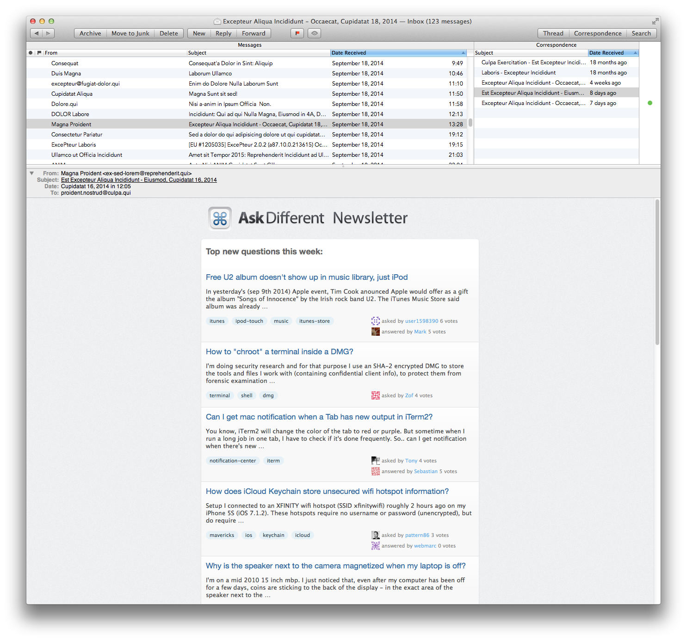

# MailMate Customizations

## Mailbox Layouts

The files [correspondence arcs.plist](Layouts/Mailboxes/correspondence arcs.plist) and [correspondence arcs (widescreen).plist](Layouts/Mailboxes/correspondence arcs (widescreen).plist) combine the *Correspondence* view with the *Thread Arcs* view. **Correspondence Arcs** is designed more for a taller, more narrow, view, while **Correspondence Arcs (Widescreen)** is designed for more for a widescreen layout. Additionally, in **Correspondence Arcs** I hide the Messages sidebar and either use the Gmail shortcuts or ⌘T to access the *Go to Mailbox* feature.




## Key bindings

| File                                                           | Description
| :---                                                           | :---
| [composer.plist](Keybindings/composer.plist)                   | Shortcuts for the email composition window
| [gmail.plist](Keybindings/gmail.plist)                         | Gmail style shortcuts in the main viewer window
| [gmail-extended.plist](Keybindings/gmail-extended.plist)       | **Custom** Gmail style shortcuts in the main viewer window
| [trackpad-gestures.plist](Keybindings/trackpad-gestures.plist) | Trackpad gestures as outlined in the manual

These are fairly self-explanatory if you look through the `plist` files. They should be placed in

	~/Library/Application Support/MailMate/Resources/KeyBindings

NOTE: You may need to make the `KeyBindings` folder if you don't already have one. See [Installation](#installation) below.

#### Some comments about [gmail.plist](Keybindings/gmail.plist) and [gmail-extended.plist](Keybindings/gmail-extended.plist)

The key bindings in [gmail.plist](Keybindings/gmail.plist) **are written to provide parity with Gmail,** to the extent that is feasible in MailMate. These go beyond what has already been done with the Gmail key bindings included in MailMate. A table of feature parity may be found in the file [gmail.md](delete-me/gmail.md).

I have additionally included a couple of (IMHO) improvements to the standard version, which are in [gmail-extended.plist](Keybindings/gmail-extended.plist):

| Shortcut | Description
| :---:    | :---
| gu       | go to smart mailbox, Unread
| gg       | move to the top of the list (Vim-style)
| ⇧G       | move to the bottom (Vim-style)
| r        | reply to message and insert salutation in message
| ⌘⇧F      | forward message as an attachment
| ⇧E       | archive all messages in the current thread
| Z        | redo
| N        | select next message for modification
| P        | select previous message for modification

## Installation

1. Mailmate user customizations are stored in `~/Library/Application Support/MailMate/Resources`. If you don't have any customizations, I'll suggest doing this:

    ```
    mkdir -p "$HOME/Library/Application Support/MailMate/Resources"
    git clone https://github.com/chauncey-garrett/mailmate.git "$HOME/Library/Application Support/MailMate/Resources"
    ```

2. To set the tags shortcut to `l`, type this in terminal:

    ```
    defaults write com.freron.MailMate MmTagsPreferencesKeyEquivalentsColumnEnabled -bool YES
    ```

    relaunch MailMate, then set the shortcut in the preferences pane.

3. MailMate > Preferences... > General > Custom Key Bindings > Enable. Then enter the key bindings that you want to enable in the box below, e.g. `trackpad-gestures,composer,gmail-extended`.

## Like it?

Add it to your toolbox; if not, open an [issue!](https://github.com/chauncey-garrett/mailmate/issues "chauncey-garrett/mailmate/issues") I appreciate all feedback.

## Author(s)

I specifically want to thank [Benny Kjær Nielsen](http://freron.com/about/index.html#about_me) for making this repository possible by producing [MailMate](http://freron.com), and for providing excellent customer support in regard to how to best make these customizations.

*The author(s) of this module should be contacted via the [issue tracker](https://github.com/chauncey-garrett/mailmate/issues "chauncey-garrett/mailmate/issues").*

  - [Chauncey Garrett](https://github.com/chauncey-garrett "chauncey-garrett")

[](http://chauncey.io/about/index.html#donate)
